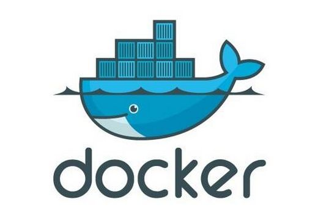

# Docker 学习笔记



## 什么是 Docker

关于 Docker 请详情查看[《什么是 Docker》][2]，这里详细介绍了 Docker 的前世今生，以及容器与传统虚拟机之间相比的不同和优势。  

下面摘抄一段容器与传统虚拟机差异的描述：  
> 传统虚拟机技术是虚拟出一套硬件后，在其上运行一个完整操作系统，在该系统上再运行所需应用进程；
> 而容器内的应用进程直接运行于宿主的内核，容器内没有自己的内核，而且也没有进行硬件虚拟。因此容器要比传统虚拟机更为轻便。

## Docker 中的概念

Docker 包括三个基本概念

* [镜像（Image）][3]：  
理解为 Java 中的类；

* [容器（Container）][4]：  
理解为 Java 中的对象(实例)；  
内容摘抄：  
> 按照 Docker 最佳实践的要求，容器不应该向其存储层内写入任何数据，容器存储层要保持无状态化。所有的文件写入操作，都应该使用 数据卷（Volume）、或者绑定宿主目录，在这些位置的读写会跳过容器存储层，直接对宿主（或网络存储）发生读写，其性能和稳定性更高。  
> 
> 数据卷的生存周期独立于容器，容器消亡，数据卷不会消亡。因此，使用数据卷后，容器删除或者重新运行之后，数据却不会丢失。

* [仓库（Repository）][5]：  
有 Docker Registry 分为公开和私有。  
内容摘抄：  
> 我们可以通过 <仓库名>:<标签> 的格式来指定具体是这个软件哪个版本的镜像。如果不给出标签，将以 latest 作为默认标签。
> 
> 以 Ubuntu 镜像 为例，ubuntu 是仓库的名字，其内包含有不同的版本标签，如，14.04, 16.04。我们可以通过 ubuntu:14.04，或者 ubuntu:16.04 来具体指定所需哪个版本的镜像。如果忽略了标签，比如 ubuntu，那将视为 ubuntu:latest。

理解了这三个概念，就理解了 Docker 的整个生命周期。

## 安装 Docker

### 树莓派

基本操作安装[《树莓派卡片电脑安装 Docker CE》][6]文章中操作，但在进行到这一段出现了问题，
````
sudo add-apt-repository "deb [arch=armhf] https://mirrors.ustc.edu.cn/docker-ce/linux/raspbian $(lsb_release -cs) stable"
````
错误信息：  
````
Error: could not find a distribution template for Raspbian/stretch
````  
最终通过编辑``sudo vi /etc/apt/sources.list``解决，在文件中添加如下内容：  
````
deb https://download.docker.com/linux/raspbian stretch stable
````

## 操作

### 镜像（Image）

### 容器（Container）

### 仓库（Repository）


## 参考
> * [Docker — 从入门到实践][1]
> * [免sudo使用docker命令][7]
 
[1]: https://yeasy.gitbooks.io/docker_practice/    "Docker — 从入门到实践"
[2]: https://yeasy.gitbooks.io/docker_practice/introduction/what.html  "什么是 Docker"
[3]: https://yeasy.gitbooks.io/docker_practice/basic_concept/image.html      "基本概念-镜像"
[4]: https://yeasy.gitbooks.io/docker_practice/basic_concept/container.html  "基本概念-容器"
[5]: https://yeasy.gitbooks.io/docker_practice/basic_concept/repository.html "基本概念-仓库"
[6]: https://yeasy.gitbooks.io/docker_practice/install/raspberry-pi.html "树莓派卡片电脑安装 Docker CE"
[7]: https://blog.csdn.net/baidu_36342103/article/details/69357438 "免sudo使用docker命令"