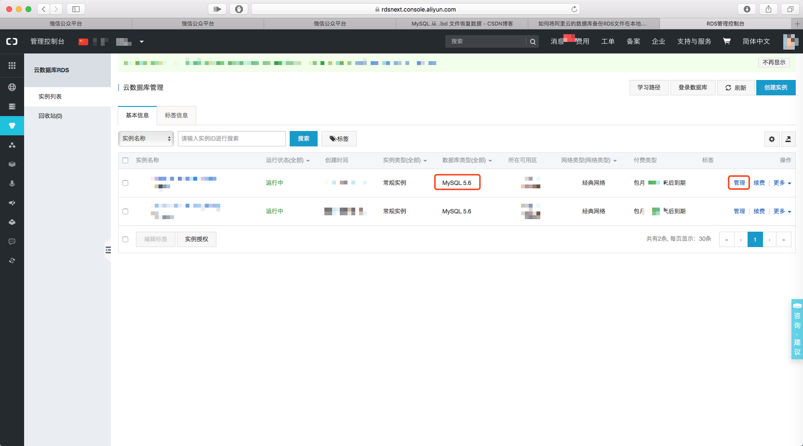
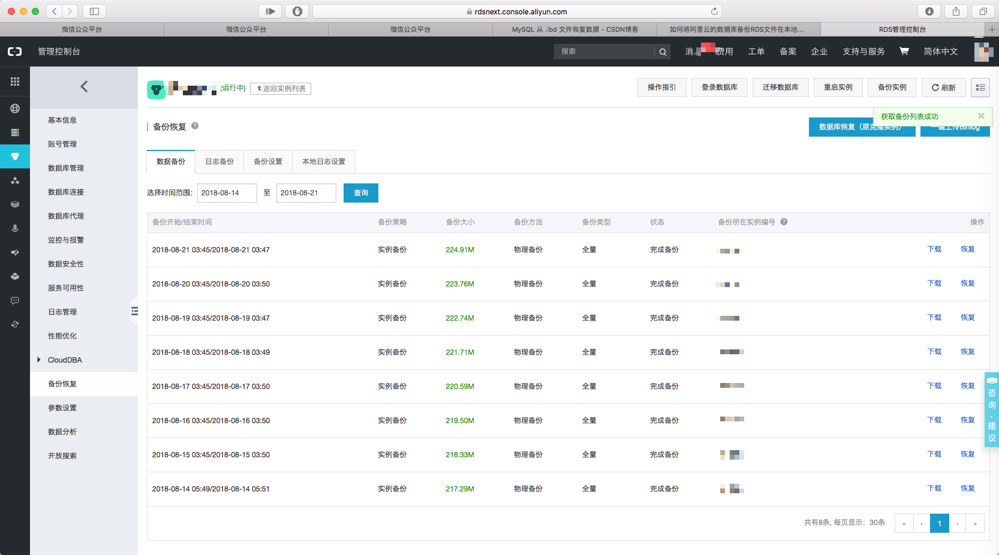

# 通过 Docker 单表数据恢复 MySQL 数据

## 由来

上周，同时安排了3个活儿，2个急活儿，1个难点；其中一项是调整线上数据（阿里云RDS MySQL 5.6）；因为着急就自作主张的没有事先备份就开始更新数据了。果然，忙中出错数据整错了。  

于是，着急忙慌的开始到处找恢复数据的办法，最终确定先把备份数据导入本地数据库，再将恢复的数据导出到线上数据环境。  

## 操作

### 下载 RDS 备份文件

登录阿里云后台管理，进入RDS，如下图。  
这里需要注意一点，就是图中红框中的版本号，因为之后需要在本地创建同样版本的数据库环境；我这里的版本是 MySQL 5.6。  
点击【管理】进入下一界面。  



下图界面中，左侧边栏选择【备份恢复】，在备份列表中选择自己需要的备份，我这里下载的最新备份。  
下载得到``hins***_data_***.tar`` TAR 文件。  



### 解压备份文件

使用 tar 命令解压 TAR 文件，得到好多文件夹和文件，其中包括 frm 和 ibd 文件，之后用的就是 ibd 文件。

````
tar -xzvf  hins2448103_data_20180127044633.tar.gz
````

### Docker 创建本地数据库

从 Docker Hub 拉取上面看到相应版本的 MySQL 镜像。

````
docker pull mysql:5.6
````

创建 MySQL 数据和配置文件存放文件夹。

````
mkdir mysql
cd mysql1
mkdir -p data logs conf
````

进入文件夹 mysql 中，执行命令运行 MySQL 容器。  

````
docker run -p 3306:3306 --name mysql -v $PWD/conf:/etc/mysql/conf.d -v $PWD/logs:/logs -v $PWD/data:/var/lib/mysql -e MYSQL_ROOT_PASSWORD=123456 -d mysql:5.6
````

### 本地数据库操作

使用数据库工具连接刚刚创建的 MySQL 容器，创建新的数据库，打开数据库，创建与要恢复表名相同的表。  

创建结束后，断开数据库连接，停掉 MySQL 容器``docker stop mysql``。

进入``mysql/conf ``文件夹，创建文件``my.cnf``内容如下。

````
[mysqld]
innodb_force_recovery=1
````

之后，再启动 MySQL 容器``docker start mysql``。

使用 Docker 命令``docker exec -it mysql /bin/bash``进入容器终端命令行，执行``mysql -uroot -p123456``命令进入 MySQL 命令行，执行命令将表结构和空间脱离。

````
mysql> alter table 表名 discard tablespace;
````

替换``mysql/data``文件夹中对应的数据文件(.ibd)，替换完成后再执行命令将表结构和空间建立关系。

````
mysql> alter table 表名 import tablespace;
````

### 数据恢复成功

现在再用数据库连接工具，看看数据是不是都恢复到表里了。

__大成功！__

## 参考

> [如何将阿里云的数据库备份RDS文件在本地恢复][1]  
> [MySQL 从 .ibd 文件恢复数据][2]  


[1]: https://blog.csdn.net/butiehua0202/article/details/79209348 "如何将阿里云的数据库备份RDS文件在本地恢复"
[2]: https://blog.csdn.net/airujingye/article/details/70526943 "MySQL 从 .ibd 文件恢复数据"