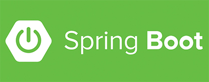

# 《2小时学会SpringBoot》笔记



## 之前接触的轻量级框架 Blade 

早就听闻 Spring Boot 的大名，在准备开始学习 Spring Cloud 的过程中，听说要学习  Spring Cloud 就要先学会 Spring Boot。  

好吧，于是在[慕课网][1]上看到了[《2小时学会SpringBoot》][2]，两小时你吃不了亏、上不了当！那就学学呗。  

接触之后才发现，有种似曾相识的感觉？噢，这跟我之前使用的[Blade][3]如此相似；原来这就是“微服务”。有 Blade 垫底这下学习 Spring Boot 就更有底气了。  

## 第一个 Spring Boot 应用

跟着[廖师兄][4]开始学习 Spring Boot，现在 Spring Boot 最新的稳定版本是 2.0.3，但教程中使用的版本为 1.4.1，于是在 IDEA 中找了目前可用的最接近的版本 1.5.14 创建了项目，项目名为 Girl。  

项目创建后，现代化的 IDEA 和 Maven 已经做好了一切初始化工作，src 中的源码、测试、资源目录，项目结构全都有了。  


### Maven 项目的核心 pom.xml

通过 pom.xml 文件可以看到项目使用到的环境和配置，Java版本为1.8，分别使用到 Spring Boot 的 web 和 test 依赖，同时还应用了 Spring Boot 的 Maven 插件。  

````
<?xml version="1.0" encoding="UTF-8"?>
<project xmlns="http://maven.apache.org/POM/4.0.0" xmlns:xsi="http://www.w3.org/2001/XMLSchema-instance"
         xsi:schemaLocation="http://maven.apache.org/POM/4.0.0 http://maven.apache.org/xsd/maven-4.0.0.xsd">
    <modelVersion>4.0.0</modelVersion>

    <groupId>com.aclyyx</groupId>
    <artifactId>girl</artifactId>
    <version>0.0.1-SNAPSHOT</version>
    <packaging>jar</packaging>

    <name>girl</name>
    <description>Demo project for Spring Boot</description>

    <parent>
        <groupId>org.springframework.boot</groupId>
        <artifactId>spring-boot-starter-parent</artifactId>
        <version>1.5.14.RELEASE</version>
        <relativePath/> <!-- lookup parent from repository -->
    </parent>

    <properties>
        <project.build.sourceEncoding>UTF-8</project.build.sourceEncoding>
        <project.reporting.outputEncoding>UTF-8</project.reporting.outputEncoding>
        <java.version>1.8</java.version>
    </properties>

    <dependencies>
        <dependency>
            <groupId>org.springframework.boot</groupId>
            <artifactId>spring-boot-starter-web</artifactId>
        </dependency>

        <dependency>
            <groupId>org.springframework.boot</groupId>
            <artifactId>spring-boot-starter-test</artifactId>
            <scope>test</scope>
        </dependency>
    </dependencies>

    <build>
        <plugins>
            <plugin>
                <groupId>org.springframework.boot</groupId>
                <artifactId>spring-boot-maven-plugin</artifactId>
            </plugin>
        </plugins>
    </build>
</project>
````

为了之后的编码方便和代码的简洁，又添加了一个 lombok 依赖，具体使用看这里[《Lombok 介绍》][5]。  

要使用 lombok，在添加依赖的同时，还有安装插件。大概步骤：打开IDEA的Setting –> 选择Plugins选项 –> 选择Browse repositories –> 搜索lombok –> 点击安装 –> 安装完成重启IDEA –> 安装成功。  

````
<!-- https://mvnrepository.com/artifact/org.projectlombok/lombok -->
<dependency>
    <groupId>org.projectlombok</groupId>
    <artifactId>lombok</artifactId>
    <version>1.16.20</version>
    <scope>provided</scope>
</dependency>
````

### Application 类

如此简单的代码，做的事可不少。运行之后，它加载了众多配置，还启动了一个 Tomcat 服务；它就是整个 WebApp。  

````
import org.springframework.boot.SpringApplication;
import org.springframework.boot.autoconfigure.SpringBootApplication;

@SpringBootApplication
public class GirlApplication {
    public static void main(String[] args) {
        SpringApplication.run(GirlApplication.class, args);
    }
}
````

### 配置文件 application.properties 或 application.yml

#### 写配置

[廖师兄][4]推荐的是 yml 文件，个人目前发现的 yml 就只有一点好处：结构清晰，这似乎就够了。  
Spring Boot 还支持多个配置文件灵活使用。比如在例程中就定义了 application-dev.yml 和 application-prod.yml 两个文件；之后，在 application.yml 配置使用哪一个，或可以在运行项目时通过参数来调整调用哪一个配置。  

##### application.yml 配置信息

````
spring:
  profiles:
    active: dev
````

##### 命令方式

````
java -jar <xxx.jar> --spring.profiles.active=prod
````

#### 读配置

在读取配置信息时，也有两种方式，
1. 直接读取赋值给变量，
2. 通过定义对象读取整个配置对象。

##### 直接读取赋值给变量

在定义 Cotroller 等实体类时，通过注解``@Value("${<xxx>}")``来直接读取配置信息并赋值给变量。  

* application.yml 文件

````
cupSize: D
````

* Java 文件

````
@Restcontroller
public class FirstController {
	@Value("${cupSize}")
	private String cupSize;
	// ... 之后，就可以在程序中使用变量 cupSize 了
}
````

##### 通过定义对象读取整个配置对象

在 yml 文件中通过层级方式定义配置信息，再定义类来接收配置信息；之后在定义 Cotroller 等实体类时，通过依赖注入将配置信息赋值给对象。  

* application.yml 文件

````
girl:
  cupSize: C
  age: 18
````

* Java 文件 - 接收配置信息类定义

````
import lombok.Data;
import org.springframework.boot.context.properties.ConfigurationProperties;
import org.springframework.stereotype.Component;

@Data
@Component
@ConfigurationProperties(prefix = "girl")
public class Girl {

    private String cupSize;
    private Integer age;
}
````

* Java 文件 - 使用

````
@RestController
public class FirstController {

    @Autowired
    private Girl girl;
    // ... 之后，就可以在程序中使用这个女孩的了
}
````

#### 系统配置信息

上面笔记中是自定义配置信息，其实在 Spring Boot 中本身就定义了很多配置项；比如：服务端口、context路径等等配置众多。  
> [springboot 修改默认端口及application.properties常用配置][6]

````
server:
  port: 8080
  context-path: /
````

### 第一个 Controller

在这个 FirstController 中，注入了配置信息，使用注释``@RestController``表示这是一个 Controller，分别通过``@RequestMapping``和``@GetMapping``定义相应 Get 请求，也展示了读取配置信息、使用请求参数的功能。  

````
import org.springframework.beans.factory.annotation.Autowired;
import org.springframework.web.bind.annotation.*;

@RestController
public class FirstController {

    @Autowired
    private Girl girl;

    @RequestMapping(value = "/hello", method = RequestMethod.GET)
    public String say() {
        return "Hello Spring boot! CupSize : " + girl.getCupSize() + ", Age : " + girl.getAge();
    }

    @GetMapping(value = "/hi1")
    public String hi1(@RequestParam(value = "id", required = false, defaultValue = "0") String myId) {
        return "ID : " + myId;
    }

    @RequestMapping(value = "/hi2/{id}", method = RequestMethod.GET)
    public String hi2(@PathVariable(value = "id") String myId) {
        return "ID : " + myId;
    }
}
````

其实 Controller 和 Mapping 也都有多种， __日后再说__（引用[廖师兄][4]原话，引经据典）。  
接收请求参数也多种[廖师兄][4]例子中展示了两种；在上面的例程hi1、hi2分别展示两种传参方式。  

## 简单数据操作

[1]: "https://www.imooc.com/" "慕课网"
[2]: "https://www.imooc.com/video/13589" "2小时学会SpringBoot"
[3]: "https://github.com/lets-blade/blade" "Blade"
[4]: "https://www.imooc.com/t/4559066" "廖师兄"
[5]: "https://blog.csdn.net/motui/article/details/79012846" "Lombok 介绍"
[6]: "https://blog.csdn.net/y534560449/article/details/53585207" "springboot 修改默认端口及application.properties常用配置"