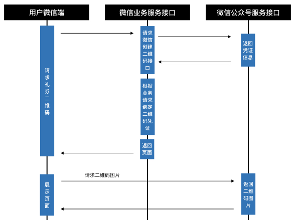

# 微信公众号开发重点记录

## 像蜂巢快递柜一样“扫一扫”干想干的事情

### 场景
使用各种公众号时，我们常常会遇到，通过微信的（“发现” --> “扫一扫” ）直接扫描二维码就跳到了微信公众号中。  
在开发公众号时，开始使用了公众号中的扫码功能（scancode_waitmsg），该功能可以通过公众号菜单触发扫码二维码功能，并把扫码的结果以消息（ScanResult）的方式转到公众号后台服务。这个功能是不错，但是，常常会使很多用户困惑，因为给这个功能扫描的二维码与“扫一扫”中的二维码是不通用的，多数人习惯了“扫一扫”，看到二维码就用“扫一扫”，却发现二维码不能被微信识别... ... 再有，公众号中的扫码功能无法扫码相册或消息图片中的二维码，而微信“扫一扫”可以... ...  
于是，想到了蜂巢快递柜，“扫一扫”直接进入公众号，直接开门，爽！  

### 方法
使用微信公众号接口《[生成带参数的二维码][1]》，使用起来也很方便就两个接口。  

1. 创建二维码ticket
2. 通过ticket换取二维码

### 创建微信二维码流程

本文就不摘抄接口文档了，画一下流程图，具体信息可以在《[生成带参数的二维码][1]》这里看到。

[1]:https://mp.weixin.qq.com/wiki?t=resource/res_main&id=mp1443433542 "生成带参数的二维码"